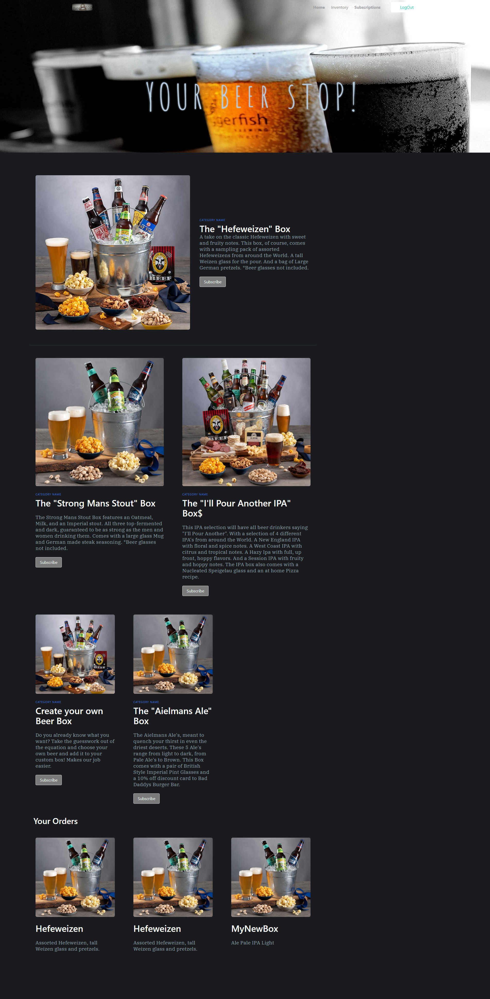

   <h1>Title Name: eCommerce Beer Box - Project 2 </h1>

## Description :

a coded-from-scratch website, front end with a heavy focus on backend, that will allow a user to input a username and password, choose from a series of different beer boxes, including one that includes a completely custom selection of beers, and saves it for the user.In future we will be able to take a payments and send those boxes to costumers.

   <h3>## Content :

- [Description](#description)
- [Instruction](#instructions)
- [Usage](#usage)
- [Contributers](#contributers)
- [GitHub](#GitHub)
- [Email](#mail)
</h3>

## Instruction :

In this project we used : VJS , MySql , Sequalize , Express , Bulma, Jquery, Anime.js

# Website Link: https://ecomercebeerbox.herokuapp.com/

## Usage :

## Contributers : Sergey Ishimov , Addison Poole , Jonatan Drabot , Samuel McSwain

## GitHub : (https://github.com/sergey-ddbug)

## Email : sishimov@gmail.com

## Deployment Link: https://github.com/Sergey-ddbug/eComerce_Beer_Box

